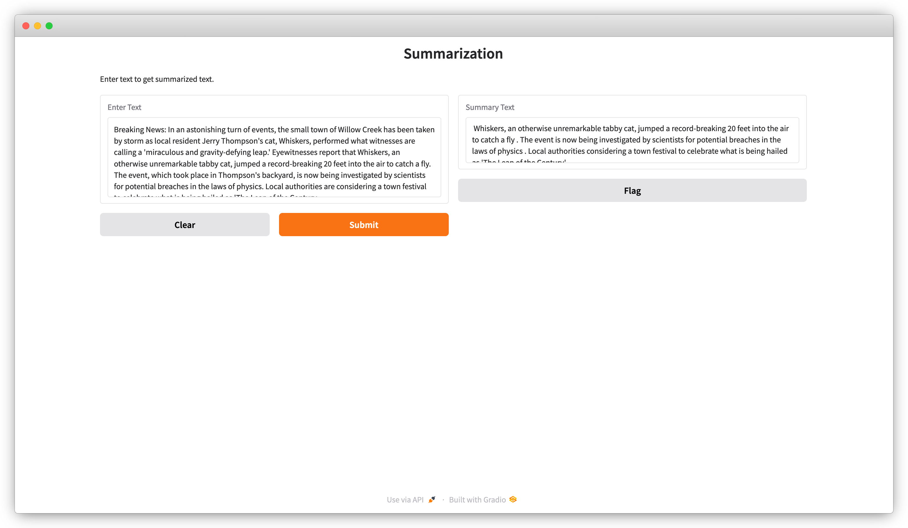

<div align="center">
    <h1 align="center">Add a UI to a BentoML Service with Gradio</h1>
</div>

[Gradio](https://github.com/gradio-app/gradio) is an open-source Python package that allows you to quickly build a web application for your model, API, or any arbitrary Python function. This project demonstrates how to add a Gradio web UI to a BentoML Service.

See [here](https://docs.bentoml.com/en/latest/examples/overview.html) for a full list of BentoML example projects.

## Install dependencies

```bash
git clone https://github.com/bentoml/BentoGradio.git
cd BentoGradio

# Recommend Python 3.11
pip install -r requirements.txt
```

## Run the BentoML Service

We have defined a BentoML Service in `service.py`. Run `bentoml serve` in your project directory to start the Service.

```python
$ bentoml serve .
```

You can access the Gradio web UI at http://localhost:3000/ui.



For detailed explanations, see [the BentoML documentation](https://docs.bentoml.com/en/latest/build-with-bentoml/gradio.html).

## Deploy to BentoCloud

After the Service is ready, you can deploy the application to BentoCloud for better management and scalability. [Sign up](https://www.bentoml.com/) if you haven't got a BentoCloud account.

Make sure you have [logged in to BentoCloud](https://docs.bentoml.com/en/latest/bentocloud/how-tos/manage-access-token.html).

```bash
bentoml cloud login
```

Deploy it from the project directory.

```bash
bentoml deploy .
```

Once the application is up and running, you can access it via the exposed URL.

**Note**: For custom deployment in your own infrastructure, use [BentoML to generate an OCI-compliant image](https://docs.bentoml.com/en/latest/get-started/packaging-for-deployment.html).
